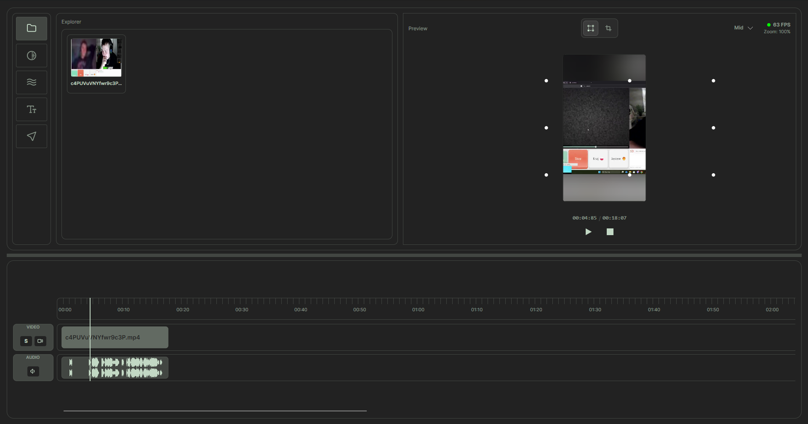
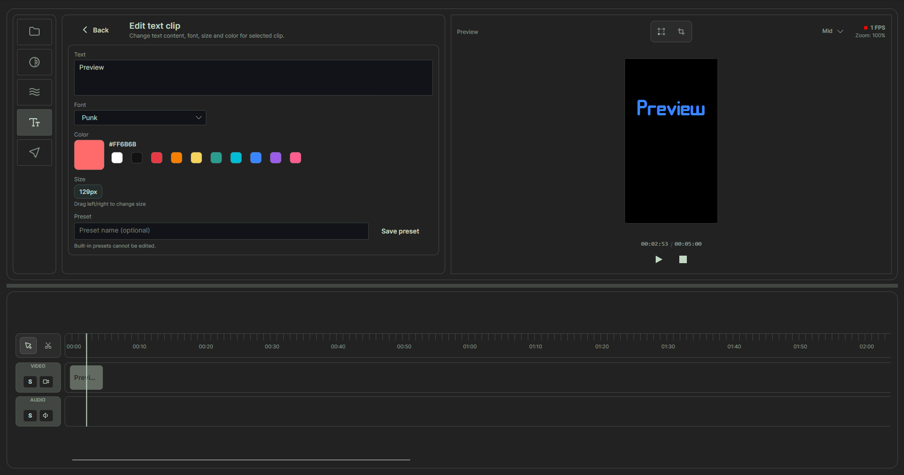

# Reels Video Editor

Desktop short-form video editor (reels/shorts) built with `C#`, `.NET 8`, and `Avalonia UI`.





## About the Project

**Reels Video Editor** is a desktop application for creating and editing short-form vertical videos (9:16 format) optimized for social media platforms. Built with C#, .NET 8, and Avalonia UI, it provides a professional-grade editing interface with real-time preview and accurate frame-by-frame export.

### Key Highlights
- **Multi-track editing** — compose videos using up to 9 independent video/audio tracks,
- **Real-time preview** — see your edits instantly with live frame composition,
- **Automatic transcription** — Whisper-based speech-to-text for auto-captions,
- **Text overlays** — create animated text with custom presets and styling,
- **Accurate export** — frame-by-frame video encoding at configurable resolutions,
- **Intuitive workflow** — import → timeline → preview → export.

### Typical Workflow
1. **Import** — drag & drop video and image files,
2. **Arrange** — compose clips on multi-track timeline,
3. **Edit** — add text overlays, adjust timing, apply effects,
4. **Preview** — watch in real-time with synchronized audio,
5. **Transcribe** — generate auto-captions from audio (Whisper),
6. **Export** — render final MP4 at desired resolution.

## Current Features

### Interface & Navigation
- **Top application menu bar** — click-open placeholder menus for `Project`, `Timeline`, `View`, and `About`,
- **Menu interaction model** — top menu dropdowns open on click for predictable navigation behavior.

### Timeline Editing
- **Multi-track editing** — up to 9 independent video lanes with individual track controls,
- **Clip arrangement** — drag-and-drop clip positioning and reordering on timeline,
- **Clip resizing** — adjust in/out points and duration per clip,
- **Timeline zoom** — 25% to 300% zoom range with dynamic label intervals,
- **Zoom shortcuts** — zoom in/out with keyboard and scroll wheel,
- **Lane height adjustment** — resize individual track heights for better visibility,
- **Copy/paste operations** — batch edit selected clips,
- **Undo/redo** — full editing history stack,
- **Waveform visualization** — audio waveform rendering on tracks,
- **Playhead scrubbing** — click-to-seek and drag playhead navigation,
- **Marker snapping** — snap-to-grid and marker-based alignment,
- **Solo and mute controls** — isolate or silence individual tracks.

### Video & Media Import
- **Media formats** — support for MP4, MOV, MKV, AVI, WebM, M4V, PNG, JPG files,
- **Drag & drop import** — import via Explorer or direct canvas drag-and-drop,
- **Clip metadata** — automatic clip duration detection via `ffprobe`,
- **Thumbnails** — frame extraction and preview thumbnails,
- **Missing media detection** — alerts for missing or unavailable clips.

### Preview & Playback
- **Real-time preview canvas** — live rendering of all timeline layers,
- **Preview quality levels** — High, Mid, Low quality options for performance tuning,
- **Playback controls** — play, pause, stop with synchronized audio,
- **Frame-by-frame stepping** — step forward/backward one frame at a time,
- **Playback seek** — scrub through video with preview synchronization,
- **Playback offset** — track and sync playhead position across preview and timeline,
- **Multi-layer composition** — render video layers with text overlays and effects.

### Text & Typography
- **Text overlays** — add and position text on video tracks,
- **Text editing panel** — edit content, font, size, and color in real-time,
- **Customizable fonts** — full Avalonia font support,
- **Color system** — predefined color palette with custom color selection,
- **Text animation** — reveal effects (e.g., Pop animation on timeline entry),
- **Draggable presets** — drag text presets from Text panel directly to timeline,
- **Custom text presets** — save, rename, update, and delete presets,
- **Preset persistence** — custom presets stored locally at `LocalApplicationData/ReelsVideoEditor/text-presets.json`,
- **Built-in presets** — Sunset, Ocean, Mint (for now) themes included out-of-box.

### Speech & Subtitles
- **Automatic transcription** — Whisper-based speech-to-text for auto-captions,
- **Word-level timing** — precise timing sync between text and audio,
- **Multi-track audio extraction** — extract and mix audio from multiple tracks for transcription,
- **Transcription progress** — real-time progress reporting during transcription,
- **Subtitle batch transforms** — apply effects and formatting to subtitle groups,
- **Auto-captions mode** — automatic subtitle generation from video audio.

### Audio System
- **Multi-track audio** — mix and manage audio from multiple clips,
- **Audio playback** — synchronized audio playback with video preview,
- **Audio mute controls** — mute individual tracks or clips,
- **Audio mixing** — blend multiple audio tracks in export pass,
- **Audio extraction** — extract audio for transcription and export.

### Frame Composition & Effects
- **Skia-based rendering** — high-quality multi-layer frame composition,
- **Blur backgrounds** — configurable background blur with adjustable sigma,
- **Layer transformations** — scaling, offset, and cropping for video layers,
- **Z-order management** — control layer stacking and visibility,
- **Text overlay rendering** — composite text with precise timing during playback,
- **Dynamic composition** — real-time preview updates as timeline changes.

## Export Pipeline

- The app exports through the **accurate frame-by-frame pipeline** (`ExportAccurateAsync`).
- Video is rendered frame-by-frame from timeline preview layers, including text overlays and effects.
- Audio clips are mixed in a separate pass (`amix`) and encoded as `aac`.
- Final output is muxed to `mp4` with `+faststart` for streaming optimization.
- Support for **multiple resolutions** and output formats.
- Progress reporting with frame count and encoding status.

### In Development / Placeholder Stages

- **Effects panel** — framework ready, basic effect library available,
- **Watermark system** — positioning and styling framework in place,

## Text Presets & Styling

### Built-in Presets (basic for now)
- **Sunset** — warm orange/red gradient with shadow styling,
- **Ocean** — cool blue tones with depth effects,
- **Mint** — fresh green palette with modern look.

### Custom Presets
- Create custom presets directly from the Text Editor panel,
- Save preset configurations (font, size, color, effects),
- Rename and update existing presets anytime,
- Delete presets with confirmation dialog,
- **Persistence** — presets stored locally at `%APPDATA%/Local/ReelsVideoEditor/text-presets.json`,
- **Machine-local** — each computer has independent preset library (by design).

### Usage
1. Edit text styling in the Text panel,
2. Click "Save Preset" and choose a name,
3. Drag preset tiles from Text panel directly onto timeline,
4. Drop on desired track and frame position to add text overlay.

## Architecture

The project follows **MVVM** (Model-View-ViewModel) with Community Toolkit support and a clear separation of concerns across functional modules.

### Core Modules

- **Timeline** — clip arrangement, zoom, playhead, and multi-track management,
- **Preview** — real-time frame composition and playback synchronization,
- **Export** — frame-by-frame video encoding via FFmpeg,
- **Text** — text overlay editing, presets, and animation system,
- **Subtitles** — transcription, batch transforms, and timing management,
- **Audio** — multi-track playback and mixing,
- **Composition** — Skia-based multi-layer frame rendering,
- **Effects** — effects framework and library infrastructure,
- **Watermarks** — positioning, styling, and animation framework,
- **VideoDecoder** — FFmpeg integration for frame extraction and media info.

### Directory Structure

- `Services/` — integration services (Export, Transcription, Composition, etc.),
- `ViewModels/` — state and interaction logic organized by module,
- `Views/` — UI components (`.axaml` + code-behind),
- `Models/` — data models and type definitions,
- `DragDrop/` — drag-and-drop contracts and payloads,
- `Effects/` — effect definitions and parameters.

### Key Flows

- `MainWindowViewModel` — composes modules and orchestrates Timeline ↔ Preview ↔ Export,
- `TimelineViewModel` — manages clips, arrangement, zoom, and playhead events,
- `PreviewViewModel` — stores playback state and frame composition transforms,
- `TimelineExportService` — builds FFmpeg commands and runs export pipeline,
- `FrameCompositionService` — handles Skia rendering of multi-layer frames.

## Repository Structure

- `ReelsVideoEditor.sln` — solution file,
- `global.json` — pinned .NET SDK version,
- `src/ReelsVideoEditor.App/` — main desktop application,
  - `Services/` — core service modules (Export, Composition, Transcription, etc.),
  - `ViewModels/` — MVVM logic organized by feature,
  - `Views/` — Avalonia UI components (.axaml),
  - `Models/` — data types and definitions,
  - `DragDrop/` — drag-and-drop contracts,
- `tests/ReelsVideoEditor.App.Tests/` — unit and integration tests,
- `readme_images/` — documentation screenshots.

## Requirements

- **.NET SDK 8.x** — for building and running the application,
- **FFmpeg & FFprobe** — for video decoding, frame extraction, and encoding,
  - Can be installed system-wide in `PATH`, or
  - Place `ffmpeg.exe` and `ffprobe.exe` in the application root directory,
- **Whisper** — for automatic speech-to-text transcription,
  - Downloaded and cached automatically on first use,
  - Requires internet connection for model download.

## Testing

The project includes automated tests for core modules:

- **Timeline tests** — clip arrangement, zoom, copy/paste, and marker snapping,
- **Export tests** — export accuracy, frame quantization, and encoding parameters,
- **Subtitle tests** — transcription, batch transforms, and word timing,
- **Composition tests** — frame rendering and multi-layer composition,
- **Playback tests** — preview synchronization and audio offset management.

Run tests:
```powershell
dotnet test ./tests/ReelsVideoEditor.App.Tests/ReelsVideoEditor.App.Tests.csproj
```

## Getting Started

### Setup

```powershell
cd reels-video-editor
dotnet restore
```

### Run

**Standard run:**
```powershell
dotnet run --project .\src\ReelsVideoEditor.App\ReelsVideoEditor.App.csproj
```

**Watch mode (auto-reload on file changes):**
```powershell
dotnet watch run --project .\src\ReelsVideoEditor.App\ReelsVideoEditor.App.csproj
```

### Build Release

```powershell
dotnet publish -c Release -o .\build --self-contained .\src\ReelsVideoEditor.App\ReelsVideoEditor.App.csproj
```

## Keyboard Shortcuts (Common)

| Action | Shortcut |
|--------|----------|
| Play/Pause | Space |
| Delete selected | Delete |
| Copy | Ctrl+C |
| Paste | Ctrl+V |
| Undo | Ctrl+Z |
| Redo | Ctrl+Shift+Z |
| Zoom In | Ctrl+Scroll ↑ |
| Zoom Out | Ctrl+Scroll ↓ |
| Toggle Mute | M (on selected track) |
| Select Mouse Tool | A |
| Select Cutter Tool | S |

Tool-switch shortcuts (`A`, `S`) and playback toggle (`Space`) are ignored while an editable text input is focused.

## Roadmap

### Short Term (In Progress)
- Complete effects panel with built-in effect library,
- Finalize watermark system with drag-and-drop positioning,
- Expand subtitle styling and formatting options,
- Add more text reveal animations and transitions.

### Mid Term
- Performance optimization for high-resolution exports,
- Advanced color correction and adjustment tools,
- Multi-platform export targets (Instagram, TikTok, YouTube Shorts),
- Batch processing for multiple projects,
- Project file format and save/load functionality.

### Long Term
- Plugin system for custom effects and transitions,
- Collaboration features and cloud integration,
- AI-powered auto-editing and recommendations,
- Hardware acceleration for video decoding and export,
- Advanced subtitle styling and automatic language translation.

## Status

**Project Status:** Active development  
**Current Focus:** Core editing, preview quality, and subtitles system refinement  
**Testing:** Automated tests for timeline, export, and composition modules  
**Production Ready:** Timeline, Preview, Export, Text, Audio, Subtitles pipelines
